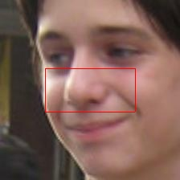

This script is used to create a dataset of BGR skin pixel values, that are drawn from a facial dataset that is balanced across several ethnic groups.


## Inspiration
This dataset is essentially a combination of the best parts of the [FairFace](https://github.com/dchen236/FairFace) and the [UCI Skin Segmentation](https://archive.ics.uci.edu/dataset/229/skin+segmentation) datasets.  While working on simple skin segmentation models, I noticed that they often underperformed for individuals with darker skin.  Assuming that this could be due to underrepresentation, I wrote the following code to create a balanced dataset.


## Issues with Existing Datasets
The UCI Skin Segmentation dataset consists of randomly sampled BGR pixels from face images of various age groups (young, middle, and old), race groups (white, black, and asian), and genders obtained from [FERET](https://en.wikipedia.org/wiki/FERET_database) database and [PAL](https://agingmind.utdallas.edu/download-stimuli/face-database/) database.  The FERET dataset is not ethnically balanced, consisting primarily of images of caucasian individuals, and the PAL dataset likely suffers the same bias.


## Making of the Dataset
An improved version of the UCI Skin Segmentation dataset can be created by randomly sampling pixels from images in the FairFace dataset, thereby producing results better representing a wide range of ethnicities (`Black, East Asian, Indian, Latino_Hispanic, Middle Eastern, Southeast Asian, White` see [FairFace Publication](https://openaccess.thecvf.com/content/WACV2021/papers/Karkkainen_FairFace_Face_Attribute_Dataset_for_Balanced_Race_Gender_and_Age_WACV_2021_paper.pdf)).  This was done in a few steps:

### Step 0)  Acquire Data
The files [fairface-img-margin025-trainval.zip](https://drive.google.com/file/d/1Z1RqRo0_JiavaZw2yzZG6WETdZQ8qX86/view), [fairface_label_train.csv](https://drive.google.com/file/d/1i1L3Yqwaio7YSOCj7ftgk8ZZchPG7dmH/view), and [fairface_label_val.csv](https://drive.google.com/file/d/1wOdja-ezstMEp81tX1a-EYkFebev4h7D/view) were acquired from [FairFace](https://github.com/dchen236/FairFace), and saved in the directory `fairface`.  The file `fairface-img-margin025-trainval.zip` was then extracted in this location.

### Step 1)  Run the Script
First, set up the conda environment with `conda env create --file environment.yml`.  Then, run `python create_dataset.py` to generate the dataset via the following:

#### Step A)  Image Subset
The FairFace dataset is not exactly balanced.  Combining the training and validation datasets, the least represented ethnicity has a bit over 10,000 images.  Therefore, a random sample of exactly 10,000 images for each ethnicity are chosen.

#### Step B)  Cropping
The images in the FairFace dataset have plenty of possible sources of noise.  Non-skin areas can result from the background, or from individuals smiling, wearing lipstick, wearing sunglasses, etc.  To help increase the proportion of skin, each image was cropped to include only the middle 24% of rows and 50% of columns.  As can be seen below, this usually greatly reduces non-skin regions:

<!-- Images with Crop Overlay -->
<p align="center">
  
  
  
  
  
</p>
<p align="center">
  
  
  
  
  
</p>

#### Step C) Sampling
One-hundred random BGR pixel values are sampled without replacement from each of the cropped images.  This results in 1,000,000 unique pixel values for each ethnic group.

#### Step D) Appending
After each image is sampled, the 100 resulting pixel values are stored in a new column called `bgr_pixel_samples`.  The BGR channel values are comma-separated, while BGR color values are tab-separated.  This is to make it relatively easy to read the data from a CSV file to a numpy array.

#### Step E) Saving
The dataframe is saved in the file `fairly_sampled_skin_pixels.csv`.


## Using the Dataset
The final dataset is stored in `fairly_sampled_skin_pixels.csv`, and looks very similar to the FairFaces dataset, but with the addition of the `bgr_pixel_samples` column.  The following code snippet can be used to read in the dataset, and format the data in `bgr_pixel_samples` back to numpy arrays:

```
    df_from_csv = pd.read_csv('fairly_sampled_skin_pixels.csv')
    df_from_csv ['bgr_pixel_samples'] = df_from_csv['bgr_pixel_samples'].apply(lambda s_list: np.array([bgr.split(',') for bgr in s_list.split('\t')]).astype(np.uint8))
```


